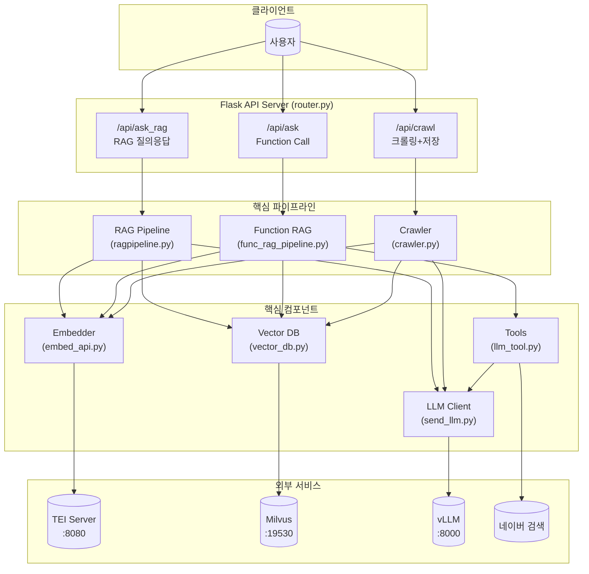
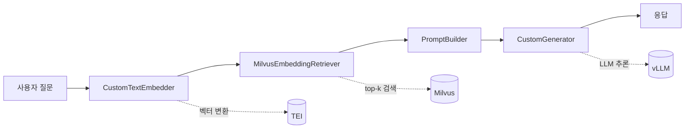
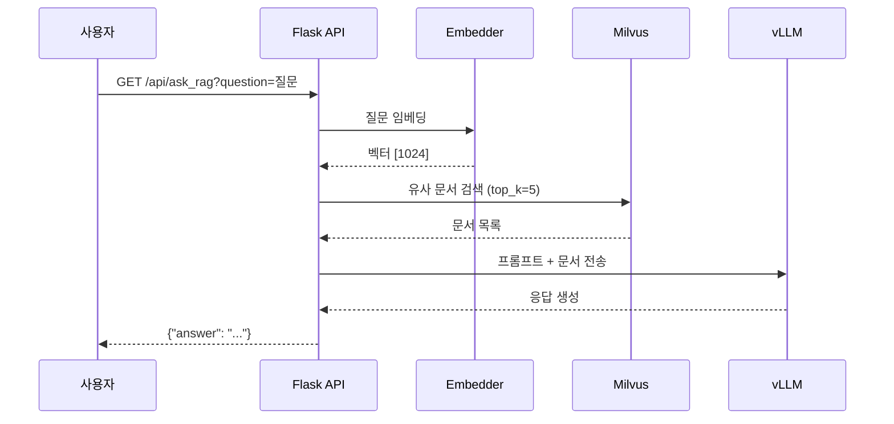
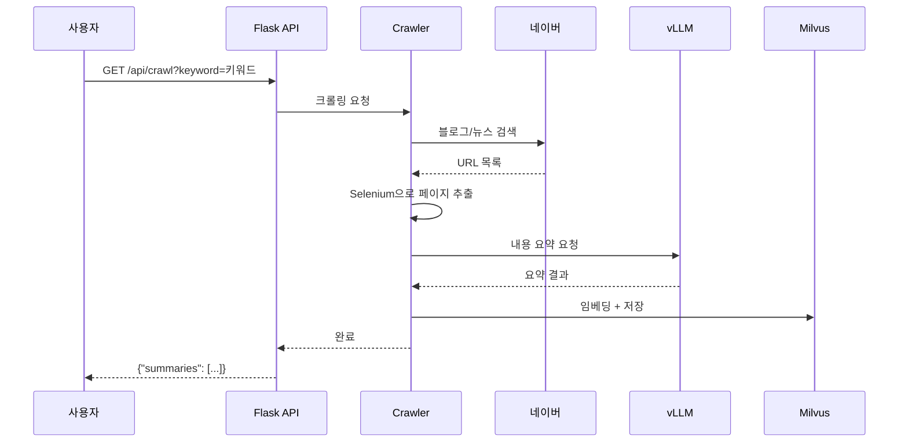
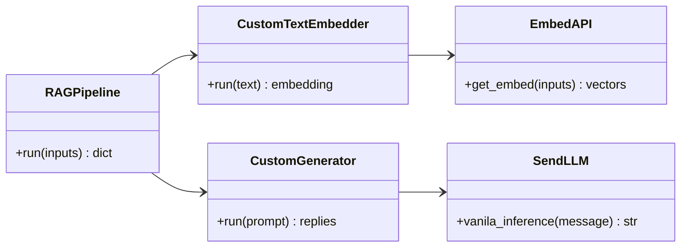
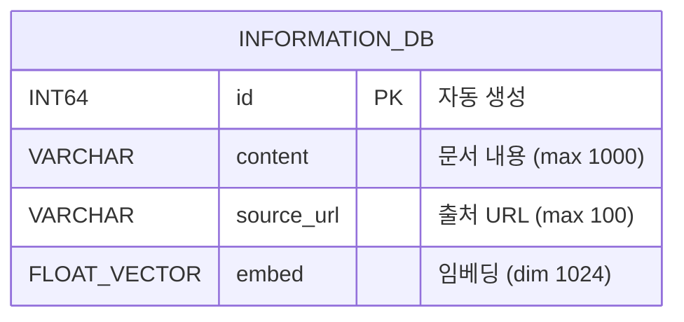

# AI Router - RAG 기반 질의응답 시스템

## 📌 프로젝트 개요

AI Router는 **RAG(Retrieval Augmented Generation)** 기반의 질의응답 시스템입니다. 
Milvus 벡터 데이터베이스와 vLLM을 활용하여 문서 검색 및 LLM 기반 응답을 생성합니다.
추가로 네이버 검색 크롤링, 국토교통부 용어 사전 검색 등의 도구(Tool)를 통해 
실시간 정보 검색 기능을 제공합니다.

---

## 🏗️ 시스템 아키텍처

> 📊 UML 다이어그램 소스: [`assets/diagrams/architecture.md`](assets/diagrams/architecture.md)



---

## 📂 프로젝트 구조

```
AI_router/
├── router.py              # Flask API 서버 (메인 진입점)
├── ragpipeline.py         # Haystack RAG 파이프라인 정의
├── func_rag_pipeline.py   # Function Calling RAG 파이프라인
├── vector_db.py           # Milvus 벡터 DB 설정
├── embed_api.py           # 텍스트 임베딩 API 클라이언트
├── send_llm.py            # vLLM 추론 클라이언트
├── llm_tool.py            # LLM Tool/Function 정의
├── crawler.py             # 네이버 검색 크롤러
├── insert2DB.py           # 벡터 DB 데이터 삽입
├── DB_create.py           # Milvus 컬렉션 스키마 생성
├── token_calc.py          # 토큰 계산 및 truncate 유틸리티
├── word_definition.py     # 국토교통부 용어 사전 검색
├── config.py              # 환경 설정 (별도 생성 필요)
├── assets/                # 정적 리소스
│   └── diagrams/          # UML 다이어그램 (Mermaid)
│       ├── architecture.md
│       ├── rag_sequence.md
│       ├── crawl_sequence.md
│       ├── class_diagram.md
│       ├── component_diagram.md
│       └── er_diagram.md
└── TEST/                  # 테스트 파일들
    ├── benchmark.py
    ├── crawler_test.py
    ├── embedding_test.py
    ├── inference_speed_test.py
    ├── insert_test.py
    ├── llm_tool_test.py
    ├── rag_pipeline_test.py
    ├── retrieve_test.py
    └── vectordb_test.py
```

---

## 🔧 핵심 컴포넌트 상세 설명

### 1. router.py (Flask API 서버)
메인 API 서버로 3개의 엔드포인트를 제공합니다:

| 엔드포인트 | 메서드 | 설명 |
|-----------|--------|------|
| `/api/ask_rag` | GET | RAG 기반 질의응답 (벡터 검색 + LLM 생성) |
| `/api/ask` | GET | Function Calling 기반 질의응답 |
| `/api/crawl` | GET | 키워드로 네이버 검색 후 결과를 DB에 저장 |

### 2. ragpipeline.py (RAG 파이프라인)
Haystack 프레임워크를 사용한 RAG 파이프라인입니다:

> 📊 상세 시퀀스 다이어그램: [`assets/diagrams/rag_sequence.md`](assets/diagrams/rag_sequence.md)



### 3. embed_api.py (임베딩 컴포넌트)
- 외부 임베딩 API(TEI 서버)를 호출하여 텍스트를 벡터로 변환
- 1024차원 벡터 사용 (BGE 모델 추정)
- 입력 텍스트는 500자로 제한

### 4. vector_db.py (벡터 데이터베이스)
- Milvus를 사용한 벡터 저장소
- GPU_CAGRA 인덱스 사용 (GPU 가속 ANN 검색)
- L2 거리 기반 유사도 측정

### 5. send_llm.py (LLM 클라이언트)
- vLLM 서버와 OpenAI 호환 API로 통신
- Qwen2-72B-Instruct 모델 사용
- 토큰 제한 초과 시 자동 truncate

### 6. llm_tool.py (Tool/Function 정의)
LLM이 사용할 수 있는 도구 정의:
- `get_word_definition`: 국토교통부 용어 사전 검색
- `search_on_online`: 네이버 실시간 검색

### 7. crawler.py (웹 크롤러)
- Selenium 기반 헤드리스 브라우저 사용
- 네이버 블로그/뉴스 검색 결과 크롤링
- LLM을 사용하여 크롤링 내용 요약
- 병렬 처리로 성능 최적화

### 8. word_definition.py (용어 사전)
- 국토교통부(molit.go.kr) 용어 검색
- 검색 결과를 LLM으로 요약하여 반환

---

## 🔄 데이터 흐름

### RAG 질의응답 흐름

> 📊 상세 시퀀스 다이어그램: [`assets/diagrams/rag_sequence.md`](assets/diagrams/rag_sequence.md)



### 크롤링 및 저장 흐름

> 📊 상세 시퀀스 다이어그램: [`assets/diagrams/crawl_sequence.md`](assets/diagrams/crawl_sequence.md)



---

## ⚙️ 환경 설정

### 필수 환경 변수 (config.py 생성 필요)
```python
# config.py
import os
from openai import OpenAI

# vLLM 서버 설정
VLLM_URL = os.getenv("VLLM_URL", "http://localhost:8000/v1")
VLLM_API_KEY = os.getenv("VLLM_API_KEY", "token-abc123")
DEFAULT_MODEL = os.getenv("DEFAULT_MODEL", "neuralmagic/Qwen2-72B-Instruct-quantized.w8a8")

# 임베딩 서버 설정
EMBED_URL = os.getenv("EMBED_URL", "http://localhost:8080/embed")

# Milvus 설정
MILVUS = os.getenv("MILVUS", "localhost")

# 토큰 제한
MAX_TOKENS = int(os.getenv("MAX_TOKENS", "4096"))

# OpenAI 클라이언트 (vLLM 호환)
client = OpenAI(base_url=VLLM_URL, api_key=VLLM_API_KEY)
model_name = DEFAULT_MODEL
```

### 외부 서비스 요구사항
| 서비스 | 기본 주소 | 설명 |
|--------|----------|------|
| vLLM | http://localhost:8000/v1 | LLM 추론 서버 |
| TEI (Embedding) | http://localhost:8080/embed | 텍스트 임베딩 서버 |
| Milvus | http://localhost:19530 | 벡터 데이터베이스 |

---

## 🚀 실행 방법

### 1. 의존성 설치
```bash
pip install flask haystack-ai milvus-haystack pymilvus openai transformers
pip install selenium beautifulsoup4 requests tqdm
```

### 2. 데이터베이스 초기화
```bash
python DB_create.py
```

### 3. 서버 실행
```bash
python router.py
```

### 4. API 사용 예시
```bash
# RAG 질의응답
curl "http://localhost:5000/api/ask_rag?question=도로정비사업이란?"

# 크롤링 및 저장
curl "http://localhost:5000/api/crawl?keyword=도로정비사업"
```

---

## 🐛 현재 발견된 문제점

### 코드 품질 이슈
1. **config.py 미포함**: 설정 파일이 버전 관리에서 제외되어 있음
2. **미완성 기능**: `router.py`에서 `funcrag_pipeline`이 import 되지 않음
3. **순환 참조 위험**: 모듈 간 import 의존성이 복잡함
4. **하드코딩된 값**: URL, 포트 등이 코드에 직접 작성됨

### 아키텍처 이슈
1. **에러 처리 불일치**: 일부 함수는 예외 처리가 없음
2. **로깅 부재**: print 문으로만 디버깅
3. **타입 힌트 부족**: 일부 함수에 타입 힌트가 없음
4. **테스트 부족**: 단위 테스트가 체계적이지 않음

### 성능 이슈
1. **동기 크롤링**: Selenium이 동기적으로 실행됨
2. **토크나이저 중복 로딩**: 매 요청마다 토크나이저가 로드될 수 있음

---

## 🔨 리팩토링 제안

### 1단계: 구조 개선
```
AI_router/
├── src/
│   ├── __init__.py
│   ├── api/                    # API 라우터
│   │   ├── __init__.py
│   │   └── routes.py
│   ├── core/                   # 핵심 비즈니스 로직
│   │   ├── __init__.py
│   │   ├── rag_pipeline.py
│   │   └── function_pipeline.py
│   ├── services/               # 외부 서비스 연동
│   │   ├── __init__.py
│   │   ├── embedding.py
│   │   ├── llm.py
│   │   ├── vector_store.py
│   │   └── crawler.py
│   ├── tools/                  # LLM 도구
│   │   ├── __init__.py
│   │   ├── dictionary.py
│   │   └── web_search.py
│   └── utils/                  # 유틸리티
│       ├── __init__.py
│       ├── config.py
│       └── token_utils.py
├── tests/                      # 테스트
│   ├── unit/
│   ├── integration/
│   └── conftest.py
├── scripts/                    # 스크립트
│   └── init_db.py
├── .env.example
├── requirements.txt
├── pyproject.toml
└── README.md
```

### 2단계: 설정 관리 개선
```python
# src/utils/config.py
from pydantic_settings import BaseSettings

class Settings(BaseSettings):
    # vLLM
    vllm_url: str = "http://localhost:8000/v1"
    vllm_api_key: str = "token-abc123"
    default_model: str = "neuralmagic/Qwen2-72B-Instruct-quantized.w8a8"
    
    # Embedding
    embed_url: str = "http://localhost:8080/embed"
    embed_dim: int = 1024
    
    # Milvus
    milvus_host: str = "localhost"
    milvus_port: int = 19530
    collection_name: str = "information_db"
    
    # Limits
    max_tokens: int = 4096
    retriever_top_k: int = 5
    
    class Config:
        env_file = ".env"

settings = Settings()
```

### 3단계: 의존성 주입 패턴 적용
```python
# src/services/llm.py
from abc import ABC, abstractmethod

class BaseLLMService(ABC):
    @abstractmethod
    def generate(self, prompt: str) -> str:
        pass

class VLLMService(BaseLLMService):
    def __init__(self, client, model_name: str):
        self.client = client
        self.model_name = model_name
    
    def generate(self, prompt: str) -> str:
        # 구현
        pass
```

### 4단계: 에러 처리 및 로깅 추가
```python
# src/utils/logger.py
import logging

def get_logger(name: str) -> logging.Logger:
    logger = logging.getLogger(name)
    logger.setLevel(logging.INFO)
    handler = logging.StreamHandler()
    handler.setFormatter(logging.Formatter(
        '%(asctime)s - %(name)s - %(levelname)s - %(message)s'
    ))
    logger.addHandler(handler)
    return logger

# src/exceptions.py
class AIRouterException(Exception):
    """기본 예외 클래스"""
    pass

class EmbeddingServiceError(AIRouterException):
    """임베딩 서비스 오류"""
    pass

class LLMServiceError(AIRouterException):
    """LLM 서비스 오류"""
    pass
```

### 5단계: 테스트 구조화
```python
# tests/unit/test_embedding.py
import pytest
from src.services.embedding import EmbeddingService

class TestEmbeddingService:
    def test_get_embed_single_text(self, mock_embed_api):
        service = EmbeddingService(mock_embed_api)
        result = service.embed("테스트 텍스트")
        assert len(result) == 1024
    
    def test_get_embed_truncates_long_text(self, mock_embed_api):
        long_text = "a" * 1000
        service = EmbeddingService(mock_embed_api)
        result = service.embed(long_text)
        assert len(result) == 1024
```

---

## 📋 리팩토링 우선순위

| 우선순위 | 작업 | 예상 효과 |
|---------|------|----------|
| 🔴 높음 | config.py를 환경변수 기반으로 정리 | 배포 용이성 향상 |
| 🔴 높음 | funcrag_pipeline import 수정 | 기능 정상화 |
| 🟡 중간 | 로깅 시스템 도입 | 디버깅 용이성 |
| 🟡 중간 | 에러 처리 통일 | 안정성 향상 |
| 🟡 중간 | 디렉토리 구조 개선 | 유지보수성 향상 |
| 🟢 낮음 | 타입 힌트 추가 | 코드 품질 향상 |
| 🟢 낮음 | 단위 테스트 작성 | 신뢰성 향상 |
| 🟢 낮음 | 비동기 처리 도입 | 성능 향상 |

---

## 📊 UML 다이어그램 목록

모든 UML 다이어그램은 Mermaid 문법으로 작성되어 있으며 `assets/diagrams/` 폴더에 저장되어 있습니다.

| 다이어그램 | 파일 | 설명 |
|-----------|------|------|
| 시스템 아키텍처 | [`architecture.md`](assets/diagrams/architecture.md) | 전체 시스템 구조 및 컴포넌트 관계 |
| RAG 시퀀스 | [`rag_sequence.md`](assets/diagrams/rag_sequence.md) | RAG 질의응답 처리 흐름 |
| 크롤링 시퀀스 | [`crawl_sequence.md`](assets/diagrams/crawl_sequence.md) | 웹 크롤링 및 저장 흐름 |
| 클래스 다이어그램 | [`class_diagram.md`](assets/diagrams/class_diagram.md) | 클래스 구조 및 관계 |
| 컴포넌트 다이어그램 | [`component_diagram.md`](assets/diagrams/component_diagram.md) | 계층별 컴포넌트 구조 |
| ER 다이어그램 | [`er_diagram.md`](assets/diagrams/er_diagram.md) | Milvus 컬렉션 스키마 |

### 클래스 다이어그램 미리보기

> 📊 전체 다이어그램: [`assets/diagrams/class_diagram.md`](assets/diagrams/class_diagram.md)



### Milvus 스키마

> 📊 전체 ER 다이어그램: [`assets/diagrams/er_diagram.md`](assets/diagrams/er_diagram.md)



---

## 📚 기술 스택

- **웹 프레임워크**: Flask
- **RAG 프레임워크**: Haystack
- **벡터 데이터베이스**: Milvus (GPU_CAGRA 인덱스)
- **LLM**: vLLM + Qwen2-72B-Instruct
- **임베딩**: Text Embeddings Inference (TEI)
- **웹 크롤링**: Selenium + BeautifulSoup
- **토크나이저**: Hugging Face Transformers

---

## 🤝 기여하기

1. 이 저장소를 Fork 합니다
2. 새로운 브랜치를 생성합니다 (`git checkout -b feature/새기능`)
3. 변경사항을 커밋합니다 (`git commit -m '새 기능 추가'`)
4. 브랜치에 Push 합니다 (`git push origin feature/새기능`)
5. Pull Request를 생성합니다

---

## 📄 라이선스

이 프로젝트는 MIT 라이선스 하에 배포됩니다.
