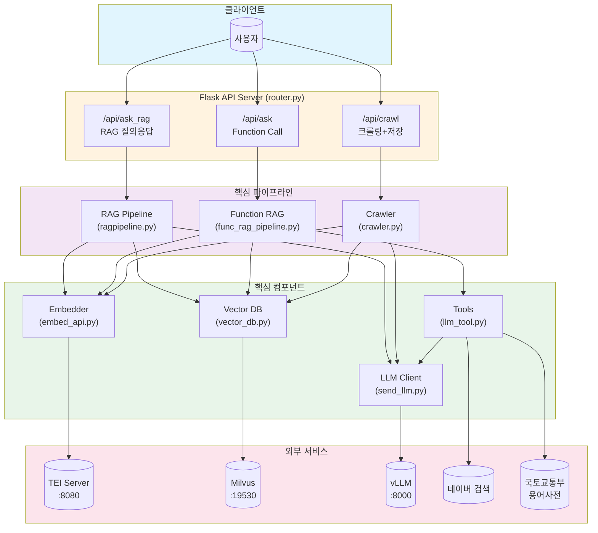

# 시스템 아키텍처 다이어그램

```mermaid
flowchart TB
    subgraph Client["클라이언트"]
        USER[("사용자")]
    end

    subgraph API["Flask API Server (router.py)"]
        ASK_RAG["/api/ask_rag<br/>RAG 질의응답"]
        ASK["/api/ask<br/>Function Call"]
        CRAWL["/api/crawl<br/>크롤링+저장"]
    end

    subgraph Core["핵심 파이프라인"]
        RAG["RAG Pipeline<br/>(ragpipeline.py)"]
        FUNC_RAG["Function RAG<br/>(func_rag_pipeline.py)"]
        CRAWLER["Crawler<br/>(crawler.py)"]
    end

    subgraph Components["핵심 컴포넌트"]
        EMBEDDER["Embedder<br/>(embed_api.py)"]
        VECTOR_DB["Vector DB<br/>(vector_db.py)"]
        LLM_CLIENT["LLM Client<br/>(send_llm.py)"]
        TOOLS["Tools<br/>(llm_tool.py)"]
    end

    subgraph External["외부 서비스"]
        TEI[("TEI Server<br/>:8080")]
        MILVUS[("Milvus<br/>:19530")]
        VLLM[("vLLM<br/>:8000")]
        NAVER[("네이버 검색")]
        MOLIT[("국토교통부<br/>용어사전")]
    end

    USER --> ASK_RAG
    USER --> ASK
    USER --> CRAWL

    ASK_RAG --> RAG
    ASK --> FUNC_RAG
    CRAWL --> CRAWLER

    RAG --> EMBEDDER
    RAG --> VECTOR_DB
    RAG --> LLM_CLIENT

    FUNC_RAG --> EMBEDDER
    FUNC_RAG --> VECTOR_DB
    FUNC_RAG --> TOOLS

    CRAWLER --> LLM_CLIENT
    CRAWLER --> EMBEDDER
    CRAWLER --> VECTOR_DB

    TOOLS --> LLM_CLIENT
    TOOLS --> NAVER
    TOOLS --> MOLIT

    EMBEDDER --> TEI
    VECTOR_DB --> MILVUS
    LLM_CLIENT --> VLLM

    style Client fill:#e1f5fe
    style API fill:#fff3e0
    style Core fill:#f3e5f5
    style Components fill:#e8f5e9
    style External fill:#fce4ec
```
