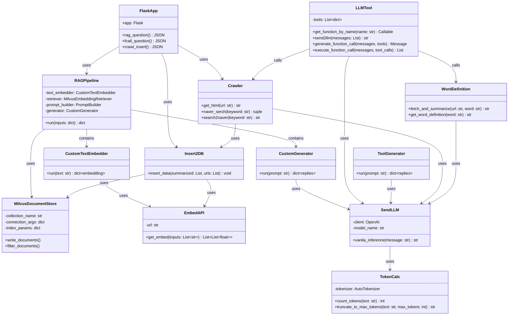

# 클래스 다이어그램

```mermaid
classDiagram
    direction TB

    class FlaskApp {
        +app: Flask
        +rag_question() JSON
        +fcall_question() JSON
        +crawl_insert() JSON
    }

    class RAGPipeline {
        -text_embedder: CustomTextEmbedder
        -retriever: MilvusEmbeddingRetriever
        -prompt_builder: PromptBuilder
        -generator: CustomGenerator
        +run(inputs: dict) dict
    }

    class CustomTextEmbedder {
        +run(text: str) dict~embedding~
    }

    class CustomGenerator {
        +run(prompt: str) dict~replies~
    }

    class MilvusDocumentStore {
        -collection_name: str
        -connection_args: dict
        -index_params: dict
        +write_documents()
        +filter_documents()
    }

    class EmbedAPI {
        -url: str
        +get_embed(inputs: List~str~) List~List~float~~
    }

    class SendLLM {
        -client: OpenAI
        -model_name: str
        +vanila_inference(message: str) str
    }

    class LLMTool {
        -tools: List~dict~
        +get_function_by_name(name: str) Callable
        +send2llm(messages: List) str
        +generate_function_call(messages, tools) Message
        +execute_function_call(messages, tool_calls) List
    }

    class ToolGenerator {
        +run(prompt: str) dict~replies~
    }

    class Crawler {
        +get_html(url: str) str
        +naver_serch(keyword: str) tuple
        +search2naver(keyword: str) str
    }

    class Insert2DB {
        +insert_data(summarized: List, urls: List) void
    }

    class WordDefinition {
        +fetch_and_summarize(url: str, word: str) str
        +get_word_definition(word: str) str
    }

    class TokenCalc {
        -tokenizer: AutoTokenizer
        +count_tokens(text: str) int
        +truncate_to_max_tokens(text: str, max_tokens: int) str
    }

    %% Relationships
    FlaskApp --> RAGPipeline : uses
    FlaskApp --> Crawler : uses
    FlaskApp --> Insert2DB : uses

    RAGPipeline --> CustomTextEmbedder : contains
    RAGPipeline --> CustomGenerator : contains
    RAGPipeline --> MilvusDocumentStore : uses

    CustomTextEmbedder --> EmbedAPI : uses
    CustomGenerator --> SendLLM : uses

    LLMTool --> SendLLM : uses
    LLMTool --> WordDefinition : calls
    LLMTool --> Crawler : calls
    ToolGenerator --> SendLLM : uses

    Crawler --> SendLLM : uses
    Crawler --> Insert2DB : uses

    Insert2DB --> EmbedAPI : uses
    Insert2DB --> MilvusDocumentStore : uses

    SendLLM --> TokenCalc : uses
    WordDefinition --> SendLLM : uses
```
