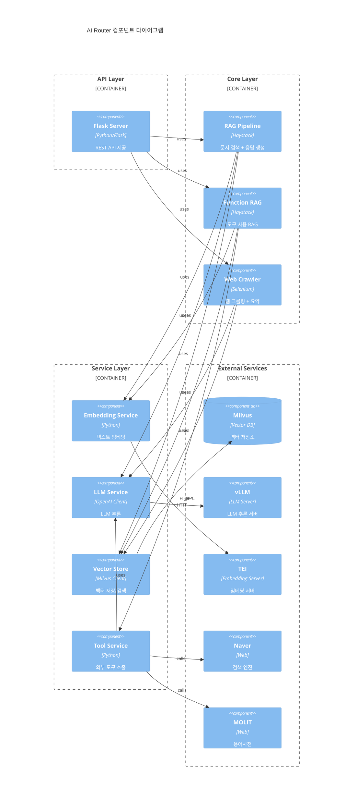
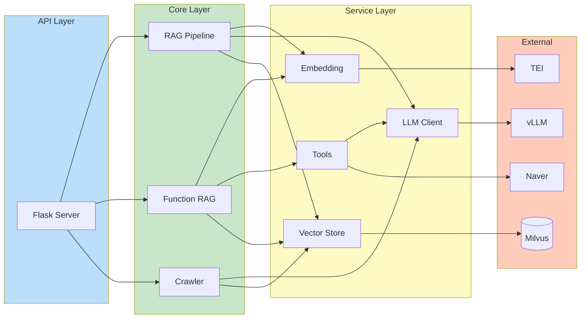

# 컴포넌트 다이어그램

```mermaid
C4Component
    title AI Router 컴포넌트 다이어그램

    Container_Boundary(api, "API Layer") {
        Component(flask, "Flask Server", "Python/Flask", "REST API 제공")
    }

    Container_Boundary(core, "Core Layer") {
        Component(rag, "RAG Pipeline", "Haystack", "문서 검색 + 응답 생성")
        Component(func_rag, "Function RAG", "Haystack", "도구 사용 RAG")
        Component(crawler, "Web Crawler", "Selenium", "웹 크롤링 + 요약")
    }

    Container_Boundary(services, "Service Layer") {
        Component(embed, "Embedding Service", "Python", "텍스트 임베딩")
        Component(llm, "LLM Service", "OpenAI Client", "LLM 추론")
        Component(vector, "Vector Store", "Milvus Client", "벡터 저장/검색")
        Component(tools, "Tool Service", "Python", "외부 도구 호출")
    }

    Container_Boundary(external, "External Services") {
        ComponentDb(milvus, "Milvus", "Vector DB", "벡터 저장소")
        Component(vllm, "vLLM", "LLM Server", "LLM 추론 서버")
        Component(tei, "TEI", "Embedding Server", "임베딩 서버")
        Component(naver, "Naver", "Web", "검색 엔진")
        Component(molit, "MOLIT", "Web", "용어사전")
    }

    Rel(flask, rag, "uses")
    Rel(flask, func_rag, "uses")
    Rel(flask, crawler, "uses")

    Rel(rag, embed, "uses")
    Rel(rag, llm, "uses")
    Rel(rag, vector, "uses")

    Rel(func_rag, embed, "uses")
    Rel(func_rag, tools, "uses")
    Rel(func_rag, vector, "uses")

    Rel(crawler, llm, "uses")
    Rel(crawler, vector, "uses")

    Rel(tools, llm, "uses")
    Rel(tools, naver, "calls")
    Rel(tools, molit, "calls")

    Rel(embed, tei, "HTTP")
    Rel(llm, vllm, "HTTP")
    Rel(vector, milvus, "gRPC")
```

---

# 대안: 기본 Flowchart 버전

```mermaid
flowchart LR
    subgraph API["API Layer"]
        FLASK[Flask Server]
    end

    subgraph Core["Core Layer"]
        RAG[RAG Pipeline]
        FUNC[Function RAG]
        CRAWL[Crawler]
    end

    subgraph Services["Service Layer"]
        EMB[Embedding]
        LLM[LLM Client]
        VEC[Vector Store]
        TOOL[Tools]
    end

    subgraph External["External"]
        MILVUS[(Milvus)]
        VLLM[vLLM]
        TEI[TEI]
        NAVER[Naver]
    end

    FLASK --> RAG
    FLASK --> FUNC
    FLASK --> CRAWL

    RAG --> EMB
    RAG --> LLM
    RAG --> VEC

    FUNC --> EMB
    FUNC --> TOOL
    FUNC --> VEC

    CRAWL --> LLM
    CRAWL --> VEC

    TOOL --> LLM
    TOOL --> NAVER

    EMB --> TEI
    LLM --> VLLM
    VEC --> MILVUS

    style API fill:#BBDEFB
    style Core fill:#C8E6C9
    style Services fill:#FFF9C4
    style External fill:#FFCCBC
```
