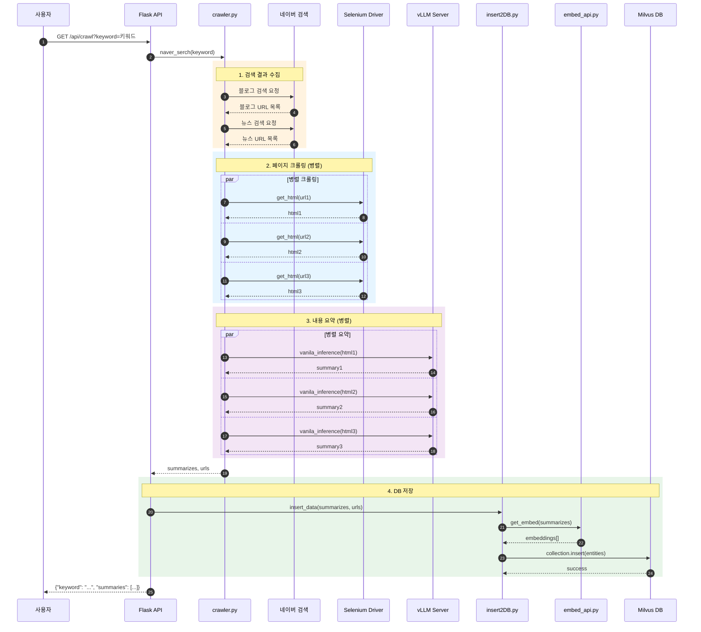

# 크롤링 흐름 시퀀스 다이어그램

```mermaid
sequenceDiagram
    autonumber
    participant User as 사용자
    participant API as Flask API
    participant Crawler as crawler.py
    participant Naver as 네이버 검색
    participant Selenium as Selenium Driver
    participant LLM as vLLM Server
    participant Insert as insert2DB.py
    participant Embed as embed_api.py
    participant Milvus as Milvus DB

    User->>API: GET /api/crawl?keyword=키워드
    API->>Crawler: naver_serch(keyword)

    rect rgb(255, 243, 224)
        Note over Crawler,Naver: 1. 검색 결과 수집
        Crawler->>Naver: 블로그 검색 요청
        Naver-->>Crawler: 블로그 URL 목록
        Crawler->>Naver: 뉴스 검색 요청
        Naver-->>Crawler: 뉴스 URL 목록
    end

    rect rgb(230, 245, 255)
        Note over Crawler,Selenium: 2. 페이지 크롤링 (병렬)
        par 병렬 크롤링
            Crawler->>Selenium: get_html(url1)
            Selenium-->>Crawler: html1
        and
            Crawler->>Selenium: get_html(url2)
            Selenium-->>Crawler: html2
        and
            Crawler->>Selenium: get_html(url3)
            Selenium-->>Crawler: html3
        end
    end

    rect rgb(243, 229, 245)
        Note over Crawler,LLM: 3. 내용 요약 (병렬)
        par 병렬 요약
            Crawler->>LLM: vanila_inference(html1)
            LLM-->>Crawler: summary1
        and
            Crawler->>LLM: vanila_inference(html2)
            LLM-->>Crawler: summary2
        and
            Crawler->>LLM: vanila_inference(html3)
            LLM-->>Crawler: summary3
        end
    end

    Crawler-->>API: summarizes, urls

    rect rgb(232, 245, 233)
        Note over API,Milvus: 4. DB 저장
        API->>Insert: insert_data(summarizes, urls)
        Insert->>Embed: get_embed(summarizes)
        Embed-->>Insert: embeddings[]
        Insert->>Milvus: collection.insert(entities)
        Milvus-->>Insert: success
    end

    API-->>User: {"keyword": "...", "summaries": [...]}
```
