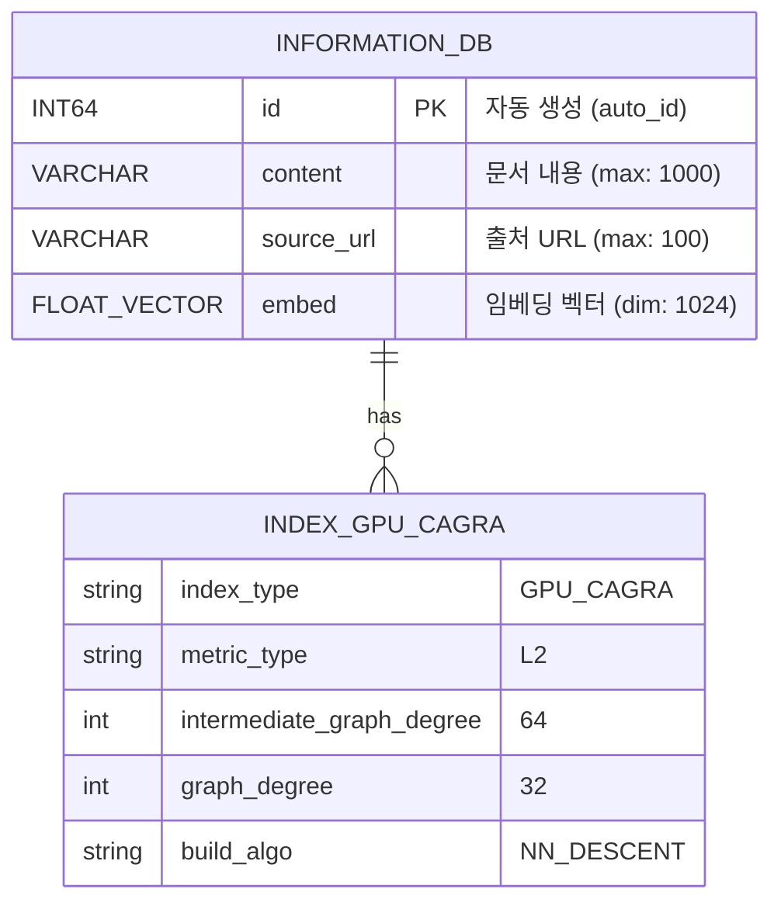
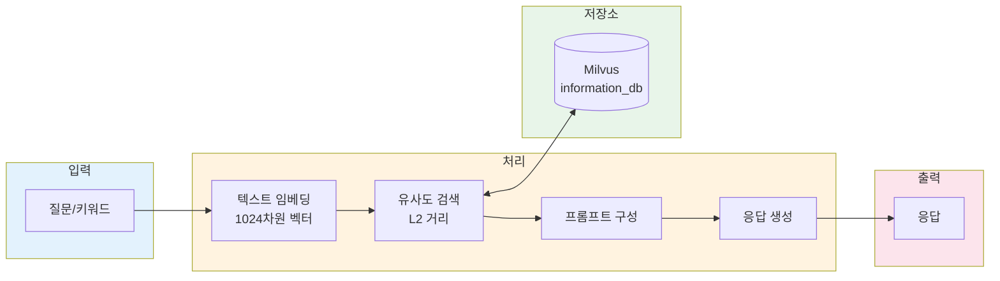

# Milvus 컬렉션 ER 다이어그램

```mermaid
erDiagram
    INFORMATION_DB {
        INT64 id PK "자동 생성 (auto_id)"
        VARCHAR content "문서 내용 (max: 1000)"
        VARCHAR source_url "출처 URL (max: 100)"
        FLOAT_VECTOR embed "임베딩 벡터 (dim: 1024)"
    }

    INFORMATION_DB ||--o{ INDEX_GPU_CAGRA : has
    
    INDEX_GPU_CAGRA {
        string index_type "GPU_CAGRA"
        string metric_type "L2"
        int intermediate_graph_degree "64"
        int graph_degree "32"
        string build_algo "NN_DESCENT"
    }
```

---

# 데이터 흐름 다이어그램

```mermaid
flowchart LR
    subgraph Input["입력"]
        Q[질문/키워드]
    end

    subgraph Processing["처리"]
        EMB[텍스트 임베딩<br/>1024차원 벡터]
        SEARCH[유사도 검색<br/>L2 거리]
        PROMPT[프롬프트 구성]
        GEN[응답 생성]
    end

    subgraph Storage["저장소"]
        MILVUS[(Milvus<br/>information_db)]
    end

    subgraph Output["출력"]
        ANS[응답]
    end

    Q --> EMB
    EMB --> SEARCH
    SEARCH <--> MILVUS
    SEARCH --> PROMPT
    PROMPT --> GEN
    GEN --> ANS

    style Input fill:#E3F2FD
    style Processing fill:#FFF3E0
    style Storage fill:#E8F5E9
    style Output fill:#FCE4EC
```
