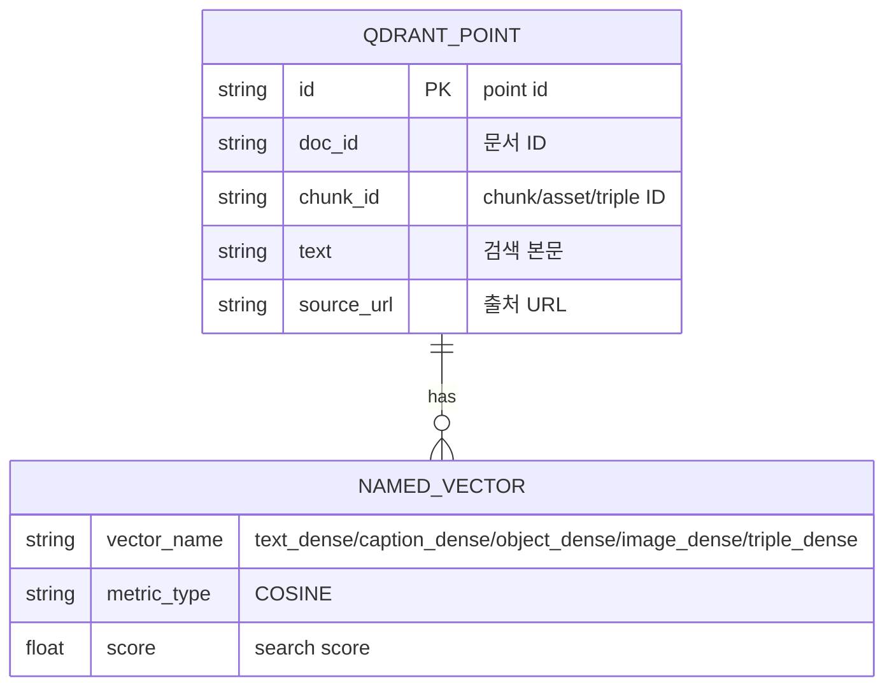
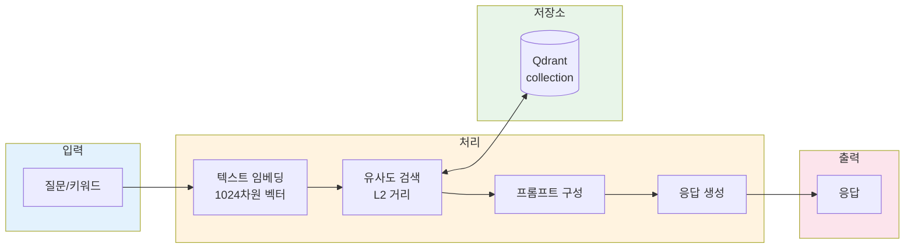

# Qdrant 컬렉션 payload 다이어그램

```mermaid
erDiagram
    QDRANT_POINT {
        string id PK "point id"
        string doc_id "문서 ID"
        string chunk_id "chunk/asset/triple ID"
        string text "검색 본문"
        string source_url "출처 URL"
    }

    QDRANT_POINT ||--o{ NAMED_VECTOR : has
    
    NAMED_VECTOR {
        string vector_name "text_dense/caption_dense/object_dense/image_dense/triple_dense"
        string metric_type "COSINE"
        float score "search score"
    }
```

---

# 데이터 흐름 다이어그램

```mermaid
flowchart LR
    subgraph Input["입력"]
        Q[질문/키워드]
    end

    subgraph Processing["처리"]
        EMB[텍스트 임베딩<br/>1024차원 벡터]
        SEARCH[유사도 검색<br/>L2 거리]
        PROMPT[프롬프트 구성]
        GEN[응답 생성]
    end

    subgraph Storage["저장소"]
        QDRANT[(Qdrant<br/>collection)]
    end

    subgraph Output["출력"]
        ANS[응답]
    end

    Q --> EMB
    EMB --> SEARCH
    SEARCH <--> QDRANT
    SEARCH --> PROMPT
    PROMPT --> GEN
    GEN --> ANS

    style Input fill:#E3F2FD
    style Processing fill:#FFF3E0
    style Storage fill:#E8F5E9
    style Output fill:#FCE4EC
```
