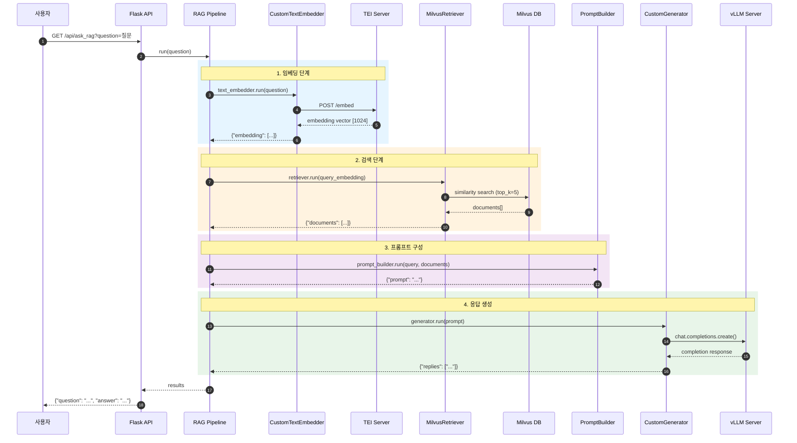

# RAG 파이프라인 시퀀스 다이어그램

```mermaid
sequenceDiagram
    autonumber
    participant User as 사용자
    participant API as Flask API
    participant Pipeline as RAG Pipeline
    participant Embedder as CustomTextEmbedder
    participant TEI as TEI Server
    participant Retriever as MilvusRetriever
    participant Milvus as Milvus DB
    participant Prompt as PromptBuilder
    participant Generator as CustomGenerator
    participant vLLM as vLLM Server

    User->>API: GET /api/ask_rag?question=질문
    API->>Pipeline: run(question)
    
    rect rgb(230, 245, 255)
        Note over Pipeline,TEI: 1. 임베딩 단계
        Pipeline->>Embedder: text_embedder.run(question)
        Embedder->>TEI: POST /embed
        TEI-->>Embedder: embedding vector [1024]
        Embedder-->>Pipeline: {"embedding": [...]}
    end

    rect rgb(255, 243, 224)
        Note over Pipeline,Milvus: 2. 검색 단계
        Pipeline->>Retriever: retriever.run(query_embedding)
        Retriever->>Milvus: similarity search (top_k=5)
        Milvus-->>Retriever: documents[]
        Retriever-->>Pipeline: {"documents": [...]}
    end

    rect rgb(243, 229, 245)
        Note over Pipeline,Prompt: 3. 프롬프트 구성
        Pipeline->>Prompt: prompt_builder.run(query, documents)
        Prompt-->>Pipeline: {"prompt": "..."}
    end

    rect rgb(232, 245, 233)
        Note over Pipeline,vLLM: 4. 응답 생성
        Pipeline->>Generator: generator.run(prompt)
        Generator->>vLLM: chat.completions.create()
        vLLM-->>Generator: completion response
        Generator-->>Pipeline: {"replies": ["..."]}
    end

    Pipeline-->>API: results
    API-->>User: {"question": "...", "answer": "..."}
```
